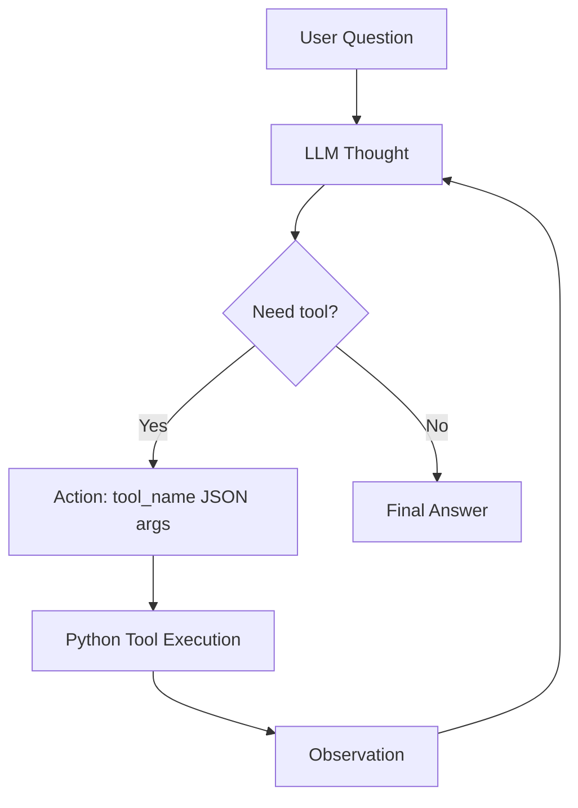

# Lab 3 Report: Chatbot vs ReAct Agent

- **Student / Team**: Nguyễn Trung Dân
- **Student ID**: 2A202601012
- **Repository Link**: https://github.com/DanNguyen05/day03_2A202601012
- **Submission Date**: 2026-06-01

---

# Part A: Group Report

Because this team has one member, the group implementation and personal contribution are both maintained by Nguyễn Trung Dân.

## Executive Summary

This lab compares a direct LLM chatbot against a ReAct agent for a Smart E-commerce Assistant. The chatbot answers directly from model knowledge, while the ReAct agent uses tools for product data, stock, discounts, shipping, and arithmetic.

- **V1 Goal**: Build a working group baseline with chatbot baseline, ReAct loop, tools, and telemetry.
- **V1 Result**: The agent completed the iPhone total-cost scenario through tool calls and logged successful traces.
- **Key Finding**: The chatbot estimated missing facts, while the ReAct agent grounded its answer in tool observations.
- **Runtime Failure Trace**: Gemini free-tier quota produced `429 RESOURCE_EXHAUSTED`; this is documented as an API quota failure, not a code failure.

## Architecture



## Tools

| Tool | Purpose |
| :--- | :--- |
| `get_product_info` | Returns product price, weight, stock, and display name. |
| `check_stock` | Checks if requested quantity is available. |
| `get_discount` | Validates coupon code and returns discount percentage. |
| `calc_shipping` | Calculates shipping cost by weight and destination. |
| `calculator` | Safely evaluates arithmetic expressions. |

## Provider

- **Model**: `gemini-2.5-flash`
- **Access Pattern**: Gemini OpenAI-compatible endpoint
- **Provider Wrapper**: `src/core/openai_provider.py`

## Evaluation Summary

| Case | Chatbot Baseline | ReAct Agent |
| :--- | :--- | :--- |
| Buy 2 iPhones with `WINNER`, ship to Hanoi | Estimated price, coupon, and shipping. | Used tools and calculated final total: `1445.08 USD`. |
| Buy 5 MacBooks with `STUDENT`, ship to Danang | May estimate without inventory check. | Uses `check_stock` and detects only 4 MacBooks are available. |

## Telemetry Evidence

The system logs structured events in `logs/`:

```text
CHATBOT_START
CHATBOT_END
AGENT_START
AGENT_STEP
TOOL_CALL
AGENT_END
LLM_METRIC
LLM_API_ERROR
```

## Failure Analysis

### API Quota Failure

- **Observed Error**: `429 RESOURCE_EXHAUSTED`
- **Cause**: Gemini free-tier quota was exceeded for `gemini-2.5-flash`.
- **Why It Matters**: ReAct agents require multiple LLM calls for a single user query, so they consume quota faster than a normal chatbot.
- **Handling**: The provider now retries transient API errors and the demo scripts show a readable quota/high-demand message.

### Model Invented Observation

- **Observed Issue**: The model sometimes generated `Observation` and `Final Answer` in the same response as an `Action`.
- **Fix**: The prompt now forbids invented observations and the agent prioritizes executing `Action` before accepting `Final Answer`.

## Web Demo

The repo includes a simple local UI:

```bash
python web_demo.py
```

Open:

```text
http://127.0.0.1:8000
```

The UI supports:

- Chatbot Baseline
- ReAct Agent V1
- ReAct Agent V2
- Mock Demo for quota-free demonstration

---

# Part B: Individual Report

## Technical Contribution

My personal V2 contribution is `ReActAgentV2`, which improves the V1 group baseline with stronger reliability controls:

- tool name validation
- required argument validation
- repeated action detection
- parser cleanup for markdown-fenced JSON
- explicit recovery logging

Files implemented:

| File | Contribution |
| :--- | :--- |
| `src/agent/agent_v2.py` | Personal V2 agent with guardrails and recovery. |
| `run_v2_demo.py` | V2 command-line runner. |
| `tests/test_agent_v2.py` | Mock tests for recovery behavior. |
| `web_demo.py` and `web/` | Local demo UI for chatbot vs agent comparison. |

## Debugging Case Study

V1 could fail when the model produced an invalid tool call:

```text
Action: calc_shipping({"destination": "Hanoi"})
```

This misses the required `weight_kg` argument. V2 detects this before tool execution and feeds back a corrective observation.

New V2 events:

```text
TOOL_VALIDATION_ERROR
LOOP_DETECTED
V2_RECOVERY
AGENT_V2_START
AGENT_V2_STEP
AGENT_V2_END
```

## Test Evidence

The V2 tests passed:

```text
python -m pytest tests/test_agent_v2.py -q
4 passed
```

The tests cover:

- missing argument recovery
- repeated action recovery
- hallucinated tool recovery
- stock checking with `check_stock`

## Personal Insights

The chatbot is simpler and cheaper for direct questions, but it guesses when facts are missing. The ReAct agent is better for multi-step tasks because it can act, observe, and continue reasoning. However, agents need guardrails because they can fail through invalid actions, parser errors, repeated loops, and API quota limits.

## Future Improvements

- Use Pydantic schemas for all tool inputs.
- Add provider fallback when Gemini quota is exhausted.
- Cache repeated observations to reduce cost.
- Add automated grading against expected answers.
- Move complex workflows to a graph-based agent framework.
