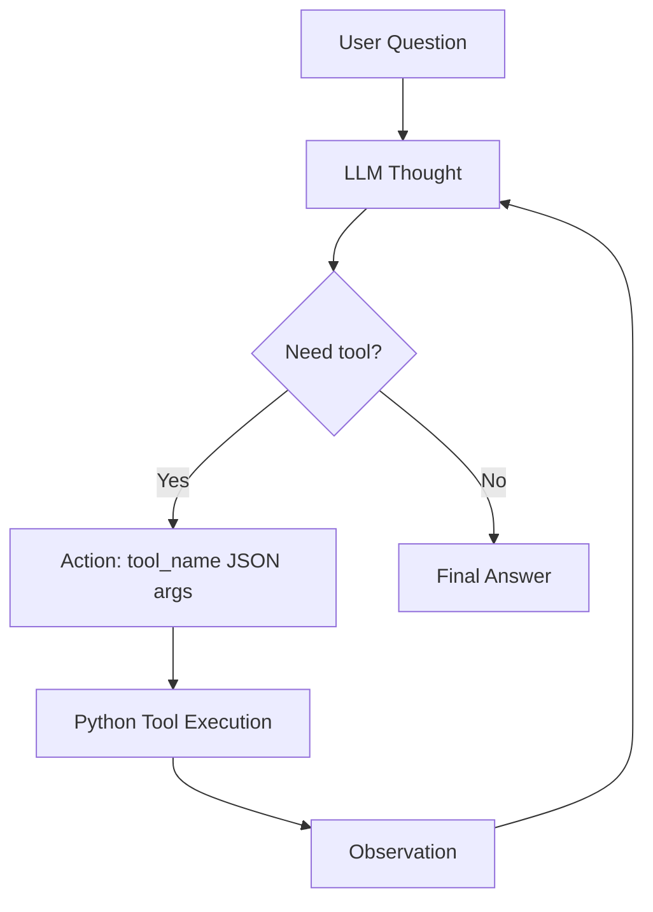

# Group Report: Lab 3 - Chatbot vs ReAct Agent V1

- **Team Name**: Nguyễn Trung Dân
- **Team Members**: Nguyễn Trung Dân
- **Deployment Date**: 2026-06-01
- **Version**: V1 Group Baseline

---

## 1. Executive Summary

Our group built a Smart E-commerce Assistant to compare a normal LLM chatbot against a ReAct agent. The chatbot answers directly from the model, while the ReAct agent uses tools to retrieve product data, coupon discounts, shipping cost, and arithmetic results.

- **Scenario**: Customer asks for final purchase cost with product quantity, coupon code, and shipping destination.
- **V1 Outcome**: The ReAct agent successfully completed the iPhone test case in logged runs by calling tools step by step.
- **Key Difference**: The chatbot estimated prices and shipping from general knowledge, while the ReAct agent grounded its answer in tool observations.
- **Dataset**: Controlled mock data in `data/products.json`, `data/coupons.json`, and `data/shipping_rates.json`.
- **Latest Runtime Issue**: The newest live run hit Gemini free-tier quota/high-demand errors (`429 RESOURCE_EXHAUSTED`). This is an API quota issue, not a code failure, and is recorded as a failure trace.

---

## 2. System Architecture & Tooling

### 2.1 ReAct Loop Implementation

The V1 agent follows this loop:

```text
User Question
-> LLM Thought
-> LLM Action: tool_name({"arg": "value"})
-> Python tool execution
-> Observation appended to prompt
-> Repeat until Final Answer
```

Flowchart:



Implementation file:

```text
src/agent/agent.py
```

The agent logs each step using structured JSON events:

```text
AGENT_START
AGENT_STEP
TOOL_CALL
LLM_METRIC
AGENT_END
PARSER_ERROR
HALLUCINATED_TOOL
LLM_API_ERROR
```

### 2.2 Tool Definitions

| Tool Name | Input Format | Use Case |
| :--- | :--- | :--- |
| `get_product_info` | `{"item_name": "iphone"}` | Returns price, weight, stock, and display name for a product. |
| `get_discount` | `{"coupon_code": "WINNER"}` | Returns coupon validity and discount percent. |
| `check_stock` | `{"item_name": "macbook", "quantity": 5}` | Checks whether requested quantity is available before purchase. |
| `calc_shipping` | `{"weight_kg": 0.44, "destination": "Hanoi"}` | Calculates shipping cost for a destination. |
| `calculator` | `{"expression": "799*2*(1-0.10)+6.88"}` | Safely evaluates arithmetic expressions. |

Tool file:

```text
src/tools/ecommerce_tools.py
```

### 2.3 Controlled Mock Dataset

The dataset is intentionally deterministic so we can verify exact answers and compare chatbot guesses against tool-grounded agent outputs.

| File | Content |
| :--- | :--- |
| `data/products.json` | 30 product records with price, category, weight, and stock. |
| `data/coupons.json` | 5 coupon records with validity and discount percentage. |
| `data/shipping_rates.json` | 7 city shipping-rate records. |

### 2.4 LLM Provider

- **Primary Provider**: Gemini through an OpenAI-compatible endpoint.
- **Model**: `gemini-2.5-flash`
- **Provider Wrapper**: `src/core/openai_provider.py`
- **Environment Variables**:

```env
LLM_ENDPOINT=...
API_KEY=...
MODEL=gemini-2.5-flash
```

---

## 3. Telemetry & Performance Dashboard

Metrics were collected from `logs/2026-06-01.log`.

### 3.1 Event Counts

| Event | Count |
| :--- | ---: |
| `CHATBOT_START` | 5 |
| `CHATBOT_END` | 1 |
| `AGENT_START` | 5 |
| `AGENT_STEP` | 16 |
| `TOOL_CALL` | 13 |
| `AGENT_END` | 3 |
| `LLM_METRIC` | 17 |
| `LLM_API_ERROR` | 6 |

### 3.2 Real API Metrics

Mock test metrics were excluded from this table.

| Metric | Value |
| :--- | ---: |
| Real LLM calls logged | 5 |
| Average latency | 5085 ms |
| P50 latency | 3680 ms |
| P99 latency | 9656 ms |
| Total tokens | 3383 |
| Average tokens per LLM call | 676.6 |
| Estimated total cost | $0.0338 |

---

## 4. Successful Trace

### Test Case

```text
I want to buy 2 iPhones using coupon WINNER and ship to Hanoi. What is the final total?
```

### Tool Trace

| Step | Tool | Key Observation |
| ---: | :--- | :--- |
| 1 | `get_product_info` | iPhone 15 price is `$799`, weight is `0.22kg`, stock is `8`. |
| 2 | `get_discount` | Coupon `WINNER` is valid with `10%` discount. |
| 3 | `calculator` | Total weight: `0.22 * 2 = 0.44kg`. |
| 4 | `calc_shipping` | Shipping to Hanoi for `0.44kg` is `$6.88`. |
| 5 | `calculator` | Final total: `799*2*(1-0.10)+6.88 = 1445.08`. |

### Final Agent Answer

```text
The final total is 1445.08 USD.
```

### Chatbot Baseline Comparison

The chatbot baseline did not have access to the catalog or shipping tool. It estimated the iPhone price and shipping cost, producing an approximate answer rather than a grounded calculation.

---

## 5. Root Cause Analysis - Failure Traces

### Case Study 1: API Quota Failure

- **Input**: Same iPhone final-total test case.
- **Observed Error**: `429 RESOURCE_EXHAUSTED`
- **Log Event**: `LLM_API_ERROR`
- **Message Summary**: Gemini free-tier quota was exceeded for `gemini-2.5-flash`. The latest run reported `GenerateRequestsPerDayPerProjectPerModel-FreeTier` with quota value `20`.
- **Root Cause**: ReAct agents require multiple LLM calls per task. A single task may use 4-6 model calls, quickly consuming free-tier quota.
- **V1 Handling**: Added retry logic for `429`, `500`, `502`, `503`, and `504`, plus graceful demo error messages.
- **Future V2 Improvement**: Add local mock mode, cache repeated tool decisions, or switch to a provider with higher quota for full evaluation.

### Case Study 2: Model Invented Observation

- **Input**: iPhone final-total test case.
- **Observed Behavior**: In an earlier run, the model outputted `Action`, fake `Observation`, and `Final Answer` in one response.
- **Root Cause**: The V1 prompt originally did not strongly forbid invented observations.
- **Fix Applied in V1**:
  - System prompt now says: "Do not invent Observation lines."
  - System prompt now says: "Do not output Final Answer in the same turn as an Action."
  - Agent parser now prioritizes executing an `Action` before accepting a `Final Answer`.

---

## 6. Chatbot vs Agent Experiment

| Case | Chatbot Result | Agent Result | Winner |
| :--- | :--- | :--- | :--- |
| Buy 2 iPhones with `WINNER`, ship to Hanoi | Estimated product price, coupon, and shipping. | Used tools for price, discount, shipping, and final arithmetic. | Agent |
| Buy 5 MacBooks with `STUDENT`, ship to Danang | Likely estimates the purchase without checking inventory. | Uses `check_stock` to detect stock issue because stock is 4. | Agent |

---

## 7. Production Readiness Review

- **Security**: Calculator uses Python AST and allows only basic arithmetic, avoiding unsafe `eval`.
- **Guardrails**: Agent has `max_steps=6` to prevent infinite loops and runaway cost.
- **Observability**: Every LLM call, tool call, parser error, and API error is logged as structured JSON.
- **Reliability Gap**: Current live evaluation depends on Gemini free-tier quota, which is too small for repeated ReAct loops.
- **Scaling Direction**: Use better tool schemas, provider fallback, cached observations, and a higher-quota model for full test suites.

---

## 8. V1 Conclusion

V1 satisfies the group baseline goal:

- Chatbot baseline implemented.
- ReAct agent implemented.
- Five tools implemented.
- Structured telemetry integrated.
- Successful and failed traces captured.
- Clear path prepared for individual V2 improvements.

Recommended individual V2 directions:

- Robust parser and retry guardrails.
- Better tool argument validation.
- Provider fallback or mock evaluation mode.
- Expanded test suite with automated success scoring.

## 9. Web Demo Dashboard

The project includes a local dashboard:

```bash
python web_demo.py
```

It supports Chatbot Baseline, ReAct Agent V1, ReAct Agent V2, and Mock Demo. The dashboard also shows dataset counts, product preview cards, coupon/city lists, and a Thought-Action-Observation trace panel. Mock Demo is the default mode so the system can be demonstrated even when Gemini quota is exhausted.
